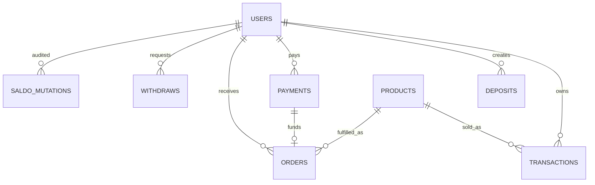

# 14-database-contract

> Source of truth aktif Premiumin Plus. PRD lama dari `legacy/archive/fase-1-docs-cleanup/docs` sudah digabung, divalidasi, lalu duplicate archive dihapus agar tidak ada dua sumber kontrak.

---

## Merged from `03-database.md`

# Premiumin Plus V3.2 Database Contract

Canonical SQL:

```text
database/schema.mysql.sql
```

Runtime validator:

```text
apps/api/backend/src/config/db.js
```

## Canonical Tables

```text
users
products
transactions
payments
deposits
orders
withdraws
saldo_logs
saldo_mutations
notifications
settings
activity_logs
finance_daily_summaries
websocket_events
temp_notifications
realtime_cache
polling_logs
```

## Users

Required columns:

```text
id
username
email
phone
password_hash
role
saldo
locked_balance
bot_access_unlocked
bot_disabled_reason
bot_session_id
bot_connected_number
bot_last_active_at
bot_session_status
api_key
reseller_request_status
created_at
updated_at
```

Role enum:

```text
admin
reseller
member
```

## Products

Final price source:

```text
products.member_price
products.reseller_price
```

Optional audit/admin pricing columns may remain:

```text
base_price
admin_margin
member_markup
reseller_markup
```

Admin product APIs may accept `price_base` as a compatibility alias, but the canonical database column remains `products.base_price`.

## Orders

Orders store provider result and credentials, but API response must mask credentials until provider success.

Required status fields:

```text
payment_status
order_status
delivery_status
```

Allowed lifecycle:

```text
pending_payment
payment_success
provider_processing
provider_success
credential_delivery
```

`order_status` may also contain:

```text
failed
```

Delivery status:

```text
pending
sent
failed
manual_pending
```

## Migration Safety

Allowed:

- create database if explicitly allowed
- create missing table
- add missing column
- add missing index
- add missing foreign key
- widen enum if needed for accepted contract

Forbidden:

- DROP TABLE
- DROP COLUMN
- TRUNCATE
- DELETE data in migration


---

## Merged from `fase-2-database.md`

# Fase 2 - Database dan Schema Canonical

Backend memakai MySQL dan menjalankan schema validator saat startup. Jika table/column penting belum ada, backend akan membuat atau menambah kolom otomatis sebelum menerima request.

## Table Utama

- `users`: akun lokal admin/reseller/member.
- `products`: katalog lokal yang bisa disinkronkan dari Premku.
- `transactions`: ledger transaksi umum untuk deposit/payment/order.
- `deposits`: QRIS top up saldo.
- `payments`: QRIS pembayaran langsung member untuk order produk.
- `orders`: riwayat order dan credential akun yang dikembalikan Premku.
- `withdraws`: tiket tarik saldo reseller.
- `saldo_logs`: audit perubahan saldo legacy-compatible.
- `saldo_mutations`: audit saldo canonical.
- `notifications`: notification center dan broadcast admin.
- `settings`: API key Premku, markup anggota/reseller, bot settings.
- `activity_logs`: audit activity login/register/admin/system.
- `finance_daily_summaries`: agregat lama agar cleanup 7 hari tidak menghilangkan total analytics admin.
- `websocket_events`, `temp_notifications`, `realtime_cache`, `polling_logs`: data realtime sementara yang aman dibersihkan.

## Kolom Penting

`users`:

- `username`, `email`, `phone`
- `password_hash`
- `role`: `admin`, `reseller`, `member`
- `saldo`
- `locked_balance`: saldo bot premium yang tidak boleh dipakai order
- `bot_access_unlocked`
- `bot_disabled_reason`
- `reseller_request_status`
- `markup_percent`

`products`:

- `premku_id`
- `name`, `code`, `note`, `image`
- `price_base`/`base_price`
- `admin_margin`
- `stock`
- `status`

Product dan margin diperlakukan sebagai satu domain pricing:

- `products.price_base` menyimpan modal/provider price.
- `products.admin_margin` menyimpan margin dasar admin per produk.
- `settings.member_markup_ranges` dan `settings.reseller_markup_ranges` menyimpan aturan markup role.
- `settings.member_markup`, `settings.reseller_markup`, dan `settings.markup_type` adalah fallback pricing ketika range tidak match.
- UI admin menggabungkan Product Management dan Margin Rules dalam satu halaman `Product & Margin` agar perubahan produk dan pricing tidak terpisah konteks.
- Simpan margin dari UI wajib mengirim fallback dan range anggota/reseller sekaligus supaya harga yang dilihat member/reseller di `GET /api/products` konsisten dengan preview admin.

Catatan naming: UI memakai label `anggota`, tetapi database/API tetap memakai enum `member` untuk kompatibilitas role lama.

`payments`:

- `invoice`
- `amount`: harga produk.
- `total_bayar`: nominal QRIS yang harus dibayar sesuai Premku.
- `payment_type`
- `status`
- `qr_image`, `qr_raw`
- `target_whatsapp`
- `processed_at`

`deposits`:

- `invoice`
- `amount`, `total_bayar`
- `payment_type`: `deposit` atau `bot_activation`
- `status`
- `qr_data`, `qr_image`, `qr_raw`
- `processed_at`, `expired_at`, `canceled_at`

`orders`:

- `invoice`, `payment_invoice`
- `product_name`
- `email_account`, `password_account`
- `payment_status`, `order_status`
- `target_whatsapp`
- `delivery_status`: `pending`, `sent`, `failed`, `manual_pending`
- `delivery_time`
- `raw_response`

`notifications`:

- `title`, `message`
- `type`
- `is_active`
- `is_pinned`
- `target_role`

## ERD Ringkas



## Index Penting

- `users.username`
- `users.api_key`
- `transactions.invoice`
- `transactions.user_id`
- `deposits.invoice`
- `payments.invoice`
- `orders.invoice`
- `orders.payment_invoice`
- `notifications.target_role`
- `activity_logs.created_at`
- `transactions.user_id, transaction_type, created_at`
- `payments.status, expired_at`
- `deposits.payment_type`

## Retention

- Detail `transactions` dan `saldo_mutations` disimpan sebagai audit finance dan tidak masuk target delete otomatis.
- Detail `orders`, `transactions`, `saldo_logs`, `saldo_mutations`, credential, deposit success, dan withdraw success tidak dihapus otomatis.
- Expired `payments` dan `deposits` boleh dibersihkan setelah 7 hari.
- Sebelum cleanup, total harian diarsipkan ke `finance_daily_summaries`.

## Bot Monetization Columns

Deposit aktivasi bot memakai `deposits.payment_type = bot_activation`. Transaksi baru yang valid adalah `bot_activation`, `locked_balance`, `bot_unlock`, dan `bot_disable`. `saldo_mutations.mutation_type` berbentuk varchar agar tipe finance baru tidak membutuhkan enum migration berulang.

## Audit Terbaru

- `database/schema.mysql.sql` sudah disinkronkan dengan validator backend untuk `users.locked_balance`, `users.bot_access_unlocked`, `users.bot_disabled_reason`, `users.reseller_request_status`, dan `deposits.payment_type`.
- `saldo_mutations.mutation_type` memakai `VARCHAR(40)` agar tipe wallet baru seperti `locked_balance` dan `bot_disable` tidak bentrok dengan enum lama.
- Admin UI sekarang memakai satu pintu `Product & Margin`; menu `Margin Rules` lama tidak ditampilkan lagi, tetapi route lama tetap diarahkan ke halaman gabungan untuk kompatibilitas.

