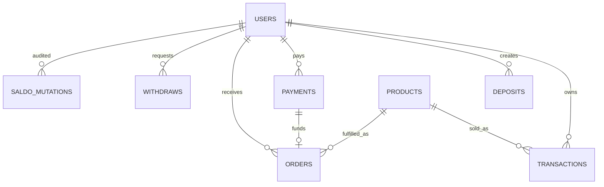

# Fase 2 - Database dan Schema Canonical

Backend memakai MySQL dan menjalankan schema validator saat startup. Jika table/column penting belum ada, backend akan membuat atau menambah kolom otomatis sebelum menerima request.

## Table Utama

- `users`: akun lokal admin/reseller/member.
- `products`: katalog lokal yang bisa disinkronkan dari Premku.
- `transactions`: ledger transaksi umum untuk deposit/payment/order.
- `deposits`: QRIS top up saldo.
- `payments`: QRIS pembayaran langsung member untuk order produk.
- `orders`: riwayat order dan credential akun yang dikembalikan Premku.
- `withdraws`: tiket tarik saldo reseller.
- `saldo_logs`: audit perubahan saldo legacy-compatible.
- `saldo_mutations`: audit saldo canonical.
- `notifications`: notification center dan broadcast admin.
- `settings`: API key Premku, markup anggota/reseller, bot settings.
- `activity_logs`: audit activity login/register/admin/system.

## Kolom Penting

`users`:

- `username`, `email`, `phone`
- `password_hash`
- `role`: `admin`, `reseller`, `member`
- `saldo`
- `markup_percent`

`products`:

- `premku_id`
- `name`, `code`, `note`, `image`
- `price_base`/`base_price`
- `admin_margin`
- `stock`
- `status`

`payments`:

- `invoice`
- `amount`: harga produk.
- `total_bayar`: nominal QRIS yang harus dibayar sesuai Premku.
- `payment_type`
- `status`
- `qr_image`, `qr_raw`
- `target_whatsapp`
- `processed_at`

`orders`:

- `invoice`, `payment_invoice`
- `product_name`
- `email_account`, `password_account`
- `payment_status`, `order_status`
- `target_whatsapp`
- `delivery_status`: `pending`, `sent`, `failed`, `manual_pending`
- `delivery_time`
- `raw_response`

`notifications`:

- `title`, `message`
- `type`
- `is_active`
- `is_pinned`
- `target_role`

## ERD Ringkas

## Index Penting

- `users.username`
- `users.api_key`
- `transactions.invoice`
- `transactions.user_id`
- `deposits.invoice`
- `payments.invoice`
- `orders.invoice`
- `orders.payment_invoice`
- `notifications.target_role`
- `activity_logs.created_at`
